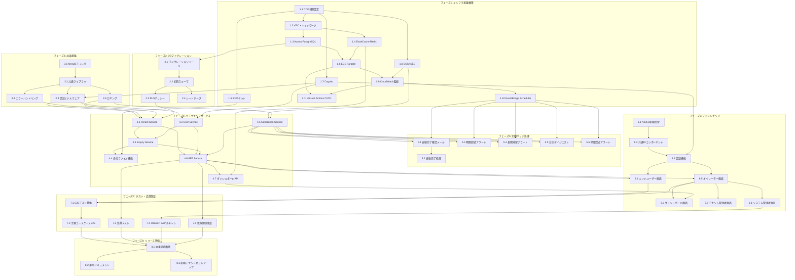

# お問い合わせ管理基盤SaaS タスク分解書

## 0. タスク管理方針

| 項目 | 方針 |
|------|------|
| 1タスク=1PR | 各タスクは1つのPull Requestとして完結 |
| タスク紐付け | 全タスクはGitHub Issueに紐付け（#番号） |
| 確認方法 | 各タスクに具体的な確認方法を明記 |
| Done条件 | Yes/No判定可能な完了条件を明記 |

---

## 1. フェーズ1: インフラ基盤構築

### 1.1 CDKプロジェクト初期設定
| 項目 | 内容 |
|------|------|
| 概要 | AWS CDK（TypeScript）プロジェクト作成、Stack構成設計 |
| 成果物 | `infra/` ディレクトリ、cdk.json、bin/app.ts |
| 確認方法 | `cdk synth` でCloudFormationテンプレート生成成功 |
| Done条件 | CI/CDでcdk synthが通る、Lintエラーなし |
| 依存タスク | なし |
| 見積もり | 0.5日 |

### 1.2 VPC・ネットワーク構築
| 項目 | 内容 |
|------|------|
| 概要 | VPC、Subnet（Public/Private）、NAT Gateway、Security Group作成 |
| 成果物 | `infra/lib/network-stack.ts` |
| 確認方法 | `cdk deploy NetworkStack` 成功、AWSコンソールで確認 |
| Done条件 | VPC作成完了、ECSタスクからインターネット疎通確認 |
| 依存タスク | 1.1 |
| 見積もり | 1日 |

### 1.3 Aurora PostgreSQL Serverless v2構築
| 項目 | 内容 |
|------|------|
| 概要 | Aurora Serverless v2クラスター作成、Secrets Manager連携 |
| 成果物 | `infra/lib/database-stack.ts` |
| 確認方法 | `psql`でDB接続成功、RLS有効化確認 |
| Done条件 | DB作成完了、初期スキーマ適用済み、RLS有効 |
| 依存タスク | 1.2 |
| 見積もり | 1日 |

### 1.4 ElastiCache Redis構築
| 項目 | 内容 |
|------|------|
| 概要 | ElastiCache Redis（キャッシュ用）作成 |
| 成果物 | `infra/lib/cache-stack.ts` |
| 確認方法 | ECSタスクからRedis接続成功 |
| Done条件 | Redis作成完了、セキュリティグループ設定済み |
| 依存タスク | 1.2 |
| 見積もり | 0.5日 |

### 1.5 S3バケット構築
| 項目 | 内容 |
|------|------|
| 概要 | 添付ファイル用S3バケット、ライフサイクルポリシー設定 |
| 成果物 | `infra/lib/storage-stack.ts` |
| 確認方法 | S3へのファイルアップロード/ダウンロード成功 |
| Done条件 | バケット作成完了、CORS設定済み、暗号化有効 |
| 依存タスク | 1.1 |
| 見積もり | 0.5日 |

### 1.6 ECS Fargate クラスター構築
| 項目 | 内容 |
|------|------|
| 概要 | ECSクラスター、ALB、CloudFront、WAF、Blue-Greenデプロイ設定 |
| 成果物 | `infra/lib/ecs-stack.ts`、`infra/lib/cdn-stack.ts` |
| 確認方法 | サンプルコンテナデプロイ、CloudFront経由アクセス成功、WAFルール適用確認 |
| Done条件 | ECSクラスター稼働、ALBヘルスチェック通過、CloudFront配信確認、WAFレート制限動作確認 |
| 依存タスク | 1.2, 1.3, 1.4 |
| 見積もり | 2日 |

### 1.7 Cognito User Pool構築
| 項目 | 内容 |
|------|------|
| 概要 | Cognito User Pool、App Client、カスタム属性設定 |
| 成果物 | `infra/lib/auth-stack.ts` |
| 確認方法 | Cognitoでユーザー作成、JWT発行成功 |
| Done条件 | User Pool作成完了、MFA設定済み、カスタム属性（role/tenant_id/service_ids）設定済み |
| 依存タスク | 1.1 |
| 見積もり | 1日 |

### 1.8 SQS + SES構築
| 項目 | 内容 |
|------|------|
| 概要 | 通知用SQSキュー、SES設定、DLQ設定 |
| 成果物 | `infra/lib/notification-stack.ts` |
| 確認方法 | SQSへのメッセージ送信、SESでメール送信成功 |
| Done条件 | SQSキュー作成完了、SESドメイン検証済み、DLQ設定済み |
| 依存タスク | 1.1 |
| 見積もり | 1日 |

### 1.9 CloudWatch監視・アラート構築
| 項目 | 内容 |
|------|------|
| 概要 | CloudWatch Dashboards、Alarms、Log Groups設定 |
| 成果物 | `infra/lib/monitoring-stack.ts` |
| 確認方法 | ダッシュボード表示、アラームトリガーテスト |
| Done条件 | 監視項目（API設計書記載）のアラーム設定完了 |
| 依存タスク | 1.6, 1.8 |
| 見積もり | 1日 |

### 1.10 EventBridge Scheduler構築
| 項目 | 内容 |
|------|------|
| 概要 | 定期ジョブ用EventBridge Scheduler設定 |
| 成果物 | `infra/lib/batch-stack.ts` |
| 確認方法 | スケジュールジョブが定刻に起動 |
| Done条件 | infra-design.md記載の6ジョブ分のスケジュール設定完了 |
| 依存タスク | 1.6 |
| 見積もり | 0.5日 |

### 1.11 GitHub Actions CI/CD構築
| 項目 | 内容 |
|------|------|
| 概要 | CI/CDパイプライン、Blue-Greenデプロイ、Rollbackワークフロー |
| 成果物 | `.github/workflows/*.yml` |
| 確認方法 | PRマージでデプロイ実行、Rollbackワークフロー実行 |
| Done条件 | CI（lint/test/build）成功、CD（deploy/rollback）成功 |
| 依存タスク | 1.6, 1.9 |
| 見積もり | 2日 |

---

## 2. フェーズ2: DBマイグレーション

### 2.1 マイグレーションツール設定
| 項目 | 内容 |
|------|------|
| 概要 | TypeORM migration設定、CI連携 |
| 成果物 | `backend/shared/migrations/`、ormconfig.ts |
| 確認方法 | `npm run migration:run` で初期スキーマ適用成功 |
| Done条件 | マイグレーション実行・ロールバック成功 |
| 依存タスク | 1.3 |
| 見積もり | 0.5日 |

### 2.2 初期スキーマ作成
| 項目 | 内容 |
|------|------|
| 概要 | db-design.md記載の全テーブル作成マイグレーション |
| 成果物 | マイグレーションファイル（11テーブル分） |
| 確認方法 | 全テーブル作成、インデックス・FK確認 |
| Done条件 | db-design.md v0.4と一致するスキーマ構築完了 |
| 依存タスク | 2.1 |
| 見積もり | 2日 |

### 2.3 RLSポリシー設定
| 項目 | 内容 |
|------|------|
| 概要 | Row Level Securityポリシー作成 |
| 成果物 | RLSポリシー用マイグレーションファイル |
| 確認方法 | テナント間データ分離テスト（他テナントデータ非表示確認） |
| Done条件 | 全対象テーブルでRLS有効、テナント分離確認済み |
| 依存タスク | 2.2 |
| 見積もり | 1日 |

### 2.4 シードデータ作成
| 項目 | 内容 |
|------|------|
| 概要 | 開発用シードデータ（テナント、サービス、カテゴリ、ユーザー） |
| 成果物 | `backend/shared/seeds/*.ts` |
| 確認方法 | `npm run seed:run` でシードデータ投入成功 |
| Done条件 | 開発環境で動作確認可能なデータセット投入完了 |
| 依存タスク | 2.2 |
| 見積もり | 1日 |

---

## 3. フェーズ3: 共通基盤

### 3.1 NestJSモノレポ初期設定
| 項目 | 内容 |
|------|------|
| 概要 | NestJS workspaces設定、共通パッケージ構成 |
| 成果物 | `backend/`（bff/inquiry/user/tenant/notification） |
| 確認方法 | `npm run build` で全サービスビルド成功 |
| Done条件 | Lintエラーなし、TypeScript strictモード有効 |
| 依存タスク | なし |
| 見積もり | 1日 |

### 3.2 共通ライブラリ作成
| 項目 | 内容 |
|------|------|
| 概要 | ULID生成、エラーハンドリング、ログ出力、DTO基底クラス |
| 成果物 | `backend/shared/libs/` |
| 確認方法 | 単体テスト実行、カバレッジレポート確認（Jest --coverage） |
| Done条件 | coding-rules.md準拠、単体テストカバレッジ80%以上、テスト全件パス |
| 依存タスク | 3.1 |
| 見積もり | 2日 |

### 3.3 認証ミドルウェア作成
| 項目 | 内容 |
|------|------|
| 概要 | JWT検証、Cognitoトークン検証、RLSセッション設定 |
| 成果物 | `backend/shared/guards/auth.guard.ts` |
| 確認方法 | 無効トークンで401、有効トークンで認可成功 |
| Done条件 | 全ロール（operator/service_admin/tenant_admin/system_admin）対応 |
| 依存タスク | 1.7, 3.2 |
| 見積もり | 2日 |

### 3.4 エラーハンドリング共通化
| 項目 | 内容 |
|------|------|
| 概要 | RFC 7807形式、例外フィルター、バリデーションエラー変換 |
| 成果物 | `backend/shared/filters/http-exception.filter.ts` |
| 確認方法 | バリデーションエラー時にRFC 7807形式レスポンス返却 |
| Done条件 | 全エラーパターンでRFC 7807形式、ログ出力確認 |
| 依存タスク | 3.2 |
| 見積もり | 1日 |

### 3.5 ロギング共通化
| 項目 | 内容 |
|------|------|
| 概要 | 構造化ログ、X-Request-ID伝播、CloudWatch出力 |
| 成果物 | `backend/shared/logger/` |
| 確認方法 | CloudWatch Logsでリクエスト追跡可能 |
| Done条件 | JSON形式ログ出力、リクエストID伝播確認 |
| 依存タスク | 3.2 |
| 見積もり | 1日 |

---

## 4. フェーズ4: バックエンドサービス

### 4.1 Tenant Service実装
| 項目 | 内容 |
|------|------|
| 概要 | テナントCRUD、営業時間設定、サービス・カテゴリ管理 |
| 成果物 | `backend/services/tenant/` |
| 確認方法 | API仕様書3.3, 3.4記載の全エンドポイント動作確認 |
| Done条件 | OpenAPI定義と一致、単体テストカバレッジ80%以上 |
| 依存タスク | 3.3, 3.4, 3.5, 2.3 |
| 見積もり | 3日 |

### 4.2 User Service実装
| 項目 | 内容 |
|------|------|
| 概要 | 管理者ユーザー管理、エンドユーザー管理、Cognito連携 |
| 成果物 | `backend/services/user/` |
| 確認方法 | ユーザー作成/更新/招待APIの動作確認 |
| Done条件 | Cognito同期正常、単体テストカバレッジ80%以上 |
| 依存タスク | 3.3, 3.4, 3.5, 2.3, 1.7 |
| 見積もり | 3日 |

### 4.3 Inquiry Service実装
| 項目 | 内容 |
|------|------|
| 概要 | 問い合わせCRUD、ステータス管理、期限計算、メッセージ管理 |
| 成果物 | `backend/services/inquiry/` |
| 確認方法 | API仕様書3.1, 3.2記載の全エンドポイント動作確認 |
| Done条件 | 状態遷移ルール遵守、単体テストカバレッジ80%以上 |
| 依存タスク | 4.1, 4.2 |
| 見積もり | 5日 |

### 4.4 添付ファイル機能実装
| 項目 | 内容 |
|------|------|
| 概要 | S3アップロード、ダウンロード、ウイルススキャン連携 |
| 成果物 | `backend/services/inquiry/attachments/` |
| 確認方法 | ファイルアップロード、署名付きURLダウンロード成功 |
| Done条件 | バリデーション（10MB上限、許可拡張子）、スキャンステータス管理 |
| 依存タスク | 4.3, 1.5 |
| 見積もり | 2日 |

### 4.5 Notification Service実装
| 項目 | 内容 |
|------|------|
| 概要 | SQS消費、メール送信（SES）、リトライ処理 |
| 成果物 | `backend/services/notification/` |
| 確認方法 | SQSメッセージ受信後、メール送信成功 |
| Done条件 | リトライ3回、DLQ移動、送信ログ記録 |
| 依存タスク | 1.8, 3.5 |
| 見積もり | 2日 |

### 4.6 BFF Service実装
| 項目 | 内容 |
|------|------|
| 概要 | フロントエンド向けAPI集約、レスポンス変換、レート制限 |
| 成果物 | `backend/services/bff/` |
| 確認方法 | OpenAPI定義の全エンドポイント動作確認、レート制限超過時429レスポンス確認 |
| Done条件 | 各サービス呼び出し成功、エラー集約動作、レート制限（エンドユーザー:100req/分、管理者:300req/分）動作確認 |
| 依存タスク | 4.1, 4.2, 4.3, 4.5 |
| 見積もり | 3日 |

### 4.7 ダッシュボードAPI実装
| 項目 | 内容 |
|------|------|
| 概要 | 集計API、Redisキャッシュ、アラート計算 |
| 成果物 | `backend/services/bff/dashboard/` |
| 確認方法 | ダッシュボードAPI（GET /admin/dashboard, /dashboard/summary, /dashboard/alerts）動作確認 |
| Done条件 | 3エンドポイント実装完了、60秒Redisキャッシュ動作確認、集計値正確性確認 |
| 依存タスク | 4.6, 1.4 |
| 見積もり | 2日 |

---

## 5. フェーズ5: 定期バッチ処理

### 5.1 自動完了確認メール送信ジョブ
| 項目 | 内容 |
|------|------|
| 概要 | 回答済み+72時間経過の問い合わせに確認メール送信 |
| 成果物 | `backend/batch/auto-completion-reminder/` |
| 確認方法 | 対象問い合わせに確認メール送信、ログ出力確認 |
| Done条件 | 毎時0分実行、リトライ3回、失敗時Slack通知 |
| 依存タスク | 4.5, 1.10 |
| 見積もり | 1日 |

### 5.2 自動完了処理ジョブ
| 項目 | 内容 |
|------|------|
| 概要 | 確認メール送信後1週間経過の問い合わせを完了に遷移 |
| 成果物 | `backend/batch/auto-completion/` |
| 確認方法 | 対象問い合わせのステータス変更確認 |
| Done条件 | 毎時0分実行、ステータス遷移正確性確認 |
| 依存タスク | 5.1 |
| 見積もり | 0.5日 |

### 5.3 期限超過アラートジョブ
| 項目 | 内容 |
|------|------|
| 概要 | 期限超過の問い合わせを検知しアラートメール送信 |
| 成果物 | `backend/batch/deadline-alert/` |
| 確認方法 | 期限超過問い合わせにアラートメール送信確認 |
| Done条件 | 毎時0分実行、重複送信防止 |
| 依存タスク | 4.5, 1.10 |
| 見積もり | 1日 |

### 5.4 長期滞留アラートジョブ
| 項目 | 内容 |
|------|------|
| 概要 | 72時間更新なしの問い合わせをサービス管理者に通知 |
| 成果物 | `backend/batch/stale-inquiry-alert/` |
| 確認方法 | 対象問い合わせにアラートメール送信確認 |
| Done条件 | 毎日9:00実行、サービス管理者宛送信 |
| 依存タスク | 4.5, 1.10 |
| 見積もり | 0.5日 |

### 5.5 日次ダイジェストジョブ
| 項目 | 内容 |
|------|------|
| 概要 | 日次ダイジェスト設定ユーザーへまとめ通知 |
| 成果物 | `backend/batch/daily-digest/` |
| 確認方法 | 設定ユーザーにダイジェストメール送信確認 |
| Done条件 | 毎日9:00実行、通知設定に応じた配信 |
| 依存タスク | 4.5, 1.10 |
| 見積もり | 1日 |

### 5.6 期限間近アラートジョブ
| 項目 | 内容 |
|------|------|
| 概要 | 期限24時間以内の問い合わせを検知し事前通知メール送信 |
| 成果物 | `backend/batch/deadline-warning/` |
| 確認方法 | 期限24時間以内の問い合わせに事前通知メール送信確認 |
| Done条件 | 毎時0分実行、重複送信防止、担当者宛送信 |
| 依存タスク | 4.5, 1.10 |
| 見積もり | 1日 |

---

## 6. フェーズ6: フロントエンド

### 6.1 Next.js App Router初期設定
| 項目 | 内容 |
|------|------|
| 概要 | Next.js 14+ App Router、Tailwind CSS、shadcn/ui設定 |
| 成果物 | `frontend/` ディレクトリ |
| 確認方法 | `npm run dev` でローカル起動、ビルド成功 |
| Done条件 | TypeScript strict、Lintエラーなし、Storybookセットアップ |
| 依存タスク | なし |
| 見積もり | 1日 |

### 6.2 共通UIコンポーネント作成
| 項目 | 内容 |
|------|------|
| 概要 | ボタン、フォーム、テーブル、モーダル等の共通コンポーネント |
| 成果物 | `frontend/components/ui/` |
| 確認方法 | Storybookでコンポーネントカタログ確認 |
| Done条件 | screen-design.md記載の画面に必要なコンポーネント完成 |
| 依存タスク | 6.1 |
| 見積もり | 3日 |

### 6.3 認証機能（Cognito連携）
| 項目 | 内容 |
|------|------|
| 概要 | ログイン、MFA、SSO、トークン管理 |
| 成果物 | `frontend/features/auth/` |
| 確認方法 | Cognito認証フロー動作確認 |
| Done条件 | ログイン/ログアウト、トークンリフレッシュ動作 |
| 依存タスク | 6.2, 1.7 |
| 見積もり | 2日 |

### 6.4 エンドユーザー画面実装
| 項目 | 内容 |
|------|------|
| 概要 | 問い合わせ投稿、履歴一覧、詳細、追加情報送信、投稿完了 |
| 成果物 | `frontend/app/(user)/` |
| 確認方法 | screen-design.md U-001〜U-004画面動作確認（U-001:投稿フォーム、U-002:履歴一覧、U-003:詳細、U-004:投稿完了） |
| Done条件 | 4画面すべて実装完了、レスポンシブ対応（PC/SP）確認済み |
| 依存タスク | 6.3, 4.6 |
| 見積もり | 3日 |

### 6.5 オペレーター画面実装
| 項目 | 内容 |
|------|------|
| 概要 | 問い合わせ一覧、詳細、回答、担当者アサイン |
| 成果物 | `frontend/app/(admin)/operator/` |
| 確認方法 | screen-design.md A-001〜A-004画面動作確認 |
| Done条件 | 全画面実装完了、リアルタイム更新（ポーリング） |
| 依存タスク | 6.3, 4.6 |
| 見積もり | 3日 |

### 6.6 ダッシュボード画面実装
| 項目 | 内容 |
|------|------|
| 概要 | 対応状況サマリ、アラート一覧、グラフ表示 |
| 成果物 | `frontend/app/(admin)/dashboard/` |
| 確認方法 | screen-design.md A-006画面動作確認 |
| Done条件 | ダッシュボードデータ表示、60秒自動更新 |
| 依存タスク | 6.5, 4.7 |
| 見積もり | 2日 |

### 6.7 テナント管理者画面実装
| 項目 | 内容 |
|------|------|
| 概要 | サービス管理、カテゴリ管理、ユーザー管理、設定 |
| 成果物 | `frontend/app/(admin)/tenant/` |
| 確認方法 | screen-design.md A-005, A-007〜A-009画面動作確認 |
| Done条件 | 全画面実装完了、CRUD操作成功 |
| 依存タスク | 6.5 |
| 見積もり | 3日 |

### 6.8 システム管理者画面実装
| 項目 | 内容 |
|------|------|
| 概要 | テナント管理、監視ダッシュボード、データエクスポート |
| 成果物 | `frontend/app/(admin)/system/` |
| 確認方法 | screen-design.md S-001〜S-004画面動作確認 |
| Done条件 | 全画面実装完了、システム権限チェック動作 |
| 依存タスク | 6.5 |
| 見積もり | 3日 |

---

## 7. フェーズ7: テスト・品質保証

### 7.1 E2Eテスト基盤構築
| 項目 | 内容 |
|------|------|
| 概要 | Playwright設定、テストシナリオ基盤 |
| 成果物 | `e2e/` ディレクトリ |
| 確認方法 | サンプルE2Eテスト実行成功 |
| Done条件 | CI/CDでE2Eテスト自動実行 |
| 依存タスク | 6.4, 6.5 |
| 見積もり | 1日 |

### 7.2 主要ユースケースE2Eテスト
| 項目 | 内容 |
|------|------|
| 概要 | 問い合わせ投稿→回答→完了の一連フロー |
| 成果物 | `e2e/scenarios/inquiry-flow.spec.ts` |
| 確認方法 | E2Eテスト全件パス |
| Done条件 | 主要10シナリオのE2Eテスト完成 |
| 依存タスク | 7.1 |
| 見積もり | 3日 |

### 7.3 負荷テスト
| 項目 | 内容 |
|------|------|
| 概要 | k6によるAPI負荷テスト、性能要件確認 |
| 成果物 | `load-test/` ディレクトリ |
| 確認方法 | 100同時ユーザーでレイテンシ1秒以内 |
| Done条件 | 非機能要件記載の性能目標達成 |
| 依存タスク | 4.6 |
| 見積もり | 2日 |

### 7.4 OWASP ZAPセキュリティスキャン
| 項目 | 内容 |
|------|------|
| 概要 | OWASP ZAP動的スキャン実施 |
| 成果物 | `security-reports/zap-scan-report.html` |
| 確認方法 | OWASP ZAP Full Scan実行、レポート生成 |
| Done条件 | Critical/High脆弱性なし、OWASP Top 10対策確認済み |
| 依存タスク | 6.8 |
| 見積もり | 1日 |

### 7.5 依存関係セキュリティ監査
| 項目 | 内容 |
|------|------|
| 概要 | npm audit、Snyk等による依存関係の脆弱性チェック |
| 成果物 | `security-reports/dependency-audit-report.json` |
| 確認方法 | `npm audit`、CI/CDでの自動監査設定確認 |
| Done条件 | Critical/High脆弱性なし、CI/CDで継続監査設定完了 |
| 依存タスク | 4.6 |
| 見積もり | 0.5日 |

---

## 8. フェーズ8: リリース準備

### 8.1 本番環境構築
| 項目 | 内容 |
|------|------|
| 概要 | 本番用CDKスタックデプロイ、シークレット設定 |
| 成果物 | 本番環境インフラ |
| 確認方法 | 本番環境ヘルスチェック通過 |
| Done条件 | 全サービス稼働、監視アラート設定済み |
| 依存タスク | 7.2, 7.3, 7.4, 7.5 |
| 見積もり | 2日 |

### 8.2 運用ドキュメント整備
| 項目 | 内容 |
|------|------|
| 概要 | 運用手順書、障害対応手順、切り戻し手順 |
| 成果物 | `docs/operations/` |
| 確認方法 | 運用チームによるドキュメントレビュー実施 |
| Done条件 | infra-design.md記載の全手順ドキュメント化完了、運用チームレビュー合格 |
| 依存タスク | 8.1 |
| 見積もり | 2日 |

### 8.3 初期テナントセットアップ
| 項目 | 内容 |
|------|------|
| 概要 | 初期テナント作成、SSO設定、動作確認 |
| 成果物 | 初期テナントデータ |
| 確認方法 | 初期テナントでエンドツーエンド動作確認 |
| Done条件 | 問い合わせ投稿〜完了の全フロー動作確認 |
| 依存タスク | 8.1 |
| 見積もり | 1日 |

---

## 9. タスク依存関係図



### 9.1 クリティカルパス

プロジェクト全体の最長経路（遅延がプロジェクト全体に直結）:

```
1.1(0.5日) → 1.2(1日) → 1.3(1日) → 1.6(2日) → 2.1(0.5日) → 2.2(2日) → 2.3(1日)
→ 4.1(3日) → 4.3(5日) → 4.6(3日) → 6.4(3日) → 7.1(1日) → 7.2(3日) → 8.1(2日)
```

**クリティカルパス合計: 28日**

| 注意すべきタスク | 理由 |
|----------------|------|
| 4.3 Inquiry Service | 5日と最も長く、問い合わせ機能の中核 |
| 4.1 Tenant Service | 4.2, 4.3の前提となるマルチテナント基盤 |
| 1.6 ECS Fargate | インフラ全体の起点、CloudFront/WAF含む |

---

## 10. マイルストーン

| マイルストーン | 対応フェーズ | 承認ポイント | 完了条件 |
|--------------|-------------|-------------|---------|
| M1: インフラ基盤完了 | フェーズ1 | - | 全Stackデプロイ完了、CI/CD稼働 |
| M2: DB基盤完了 | フェーズ2 | - | スキーマ構築完了、RLS動作確認 |
| M3: バックエンド完了 | フェーズ3+4 | - | 全API動作確認、テストカバレッジ80%達成 |
| M4: バッチ処理完了 | フェーズ5 | - | 全6ジョブ動作確認 |
| M5: フロントエンド完了 | フェーズ6 | - | 全画面実装完了、レスポンシブ確認 |
| M6: 品質保証完了 | フェーズ7 | 実装・レビュー完了（承認ポイント6） | E2E・負荷・セキュリティテスト合格 |
| M7: リリース準備完了 | フェーズ8 | リリース承認（承認ポイント7） | 本番稼働、運用ドキュメント整備 |

### 見積もりサマリ

| フェーズ | タスク数 | 合計見積もり |
|---------|---------|-------------|
| フェーズ1: インフラ基盤構築 | 11 | 11.5日 |
| フェーズ2: DBマイグレーション | 4 | 4.5日 |
| フェーズ3: 共通基盤 | 5 | 7日 |
| フェーズ4: バックエンドサービス | 7 | 20日 |
| フェーズ5: 定期バッチ処理 | 6 | 5日 |
| フェーズ6: フロントエンド | 8 | 20日 |
| フェーズ7: テスト・品質保証 | 5 | 7.5日 |
| フェーズ8: リリース準備 | 3 | 5日 |
| **合計** | **49** | **80.5日** |

※並行作業可能なタスクを考慮すると、実稼働日数はクリティカルパス（28日）+バッファで約35〜40日を想定

---

## 11. 対応設計書バージョン

本タスク分解書は以下の設計書バージョンに基づく：

| 設計書 | バージョン |
|--------|-----------|
| api-design.md | v0.5 |
| db-design.md | v0.4 |
| infra-design.md | v0.3 |
| screen-design.md | v0.2 |
| coding-rules.md | v0.2 |

---

## 12. 改訂履歴

| 日付 | バージョン | 変更内容 | 作成者 |
|------|-----------|---------|--------|
| 2026-02-05 | 0.1 | 初版作成（全タスク定義、依存関係整理） | Claude |
| 2026-02-05 | 0.2 | QC対応: 期限間近アラートジョブ追加、セキュリティテスト分割、依存関係図Mermaid化、Done条件明確化 | Claude |
| 2026-02-05 | 0.3 | QC対応: CloudFront/WAF明記、クリティカルパス追加、マイルストーン追加、全タスク見積もり追加 | Claude |
